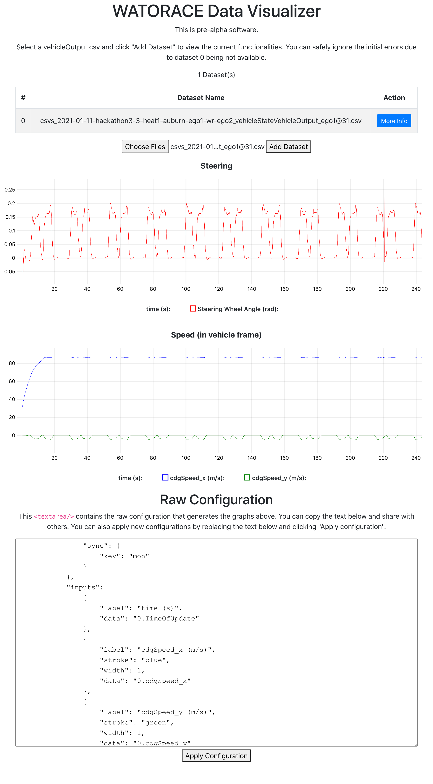

# WATORACE Data Visualization

Data visualization tool for WATORACE



## Features

### Planned features:
- [x] Import data (csv) and visualize graphs (achieved using [Papa Parse][PapaParse] and [uPlot][uPlot])
- [x] Synchronized cursors and zoom (achieved using [uPlot][uPlot])
- [ ] Support transforms (e.g. degrees<->radians)
- [ ] UI for constructing visualizations (this is currently achieved by editing the JSON on the "Raw Configuration" page)
- [x] Import/export configurations (achieved using the "Raw Configuration" section)
- [ ] Import data via URL (supported natively in Papa Parse, but we need to make a few adjustments to code that rely on having a file name). Depends on making our data pipeline publicly accessible.

### Optional Features

- [ ] XY Plot (visualize the vehicle in 2D space; not supported natively in uPlot)
- [ ] Video display/synchronization (display a video alongside the plots and synchronize scrubbing)

## Getting Started

Start the application for development:

```bash
git clone git@github.com:WATORACE/data-visualization.git
cd data-visualization
npm start
```

### Deployment

The application generates static HTML/Javascript/CSS files that can be deployed on any static file server. To deploy to github pages:

```bash
npm run deploy
```

To learn about other deployment options, please see [here](https://create-react-app.dev/docs/deployment/).
[uPlot]: https://github.com/leeoniya/uPlot
[PapaParse]: https://www.papaparse.com/
